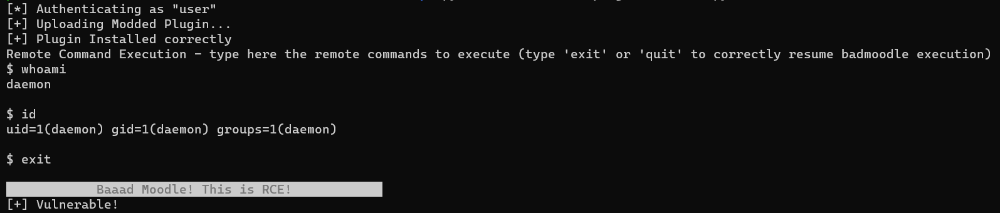

# RCE-moodle-install-plugin-from-zip
Install Plugin from ZIP - This is a functionality that allows an authenticated user to install arbitrary (modded) extensions and so, remotely run PHP commands on the server. You need elevated privileges to install plugins on Moodle applications. This script is also a badmoodle module.
<br><br>
### Usage
```
        ./RCE-install-plugin-from-ZIP.py -a <username>:<password> -u <URL/Domain/IP>
        
Examples:
        ->  ./RCE-install-plugin-from-ZIP.py -a user:password -u 192.168.161.178
        ->  ./RCE-install-plugin-from-ZIP.py -a user:password -u mymoodle.domain.com
        ->  ./RCE-install-plugin-from-ZIP.py -a user:password -u http://mymoodle.domain.com/
 _____________________________________________________________________________
| Arguments:                     |                                            |
|   -u <URL/IP>                  |  URL/IP to scan          Mandatory? YES    |
|   -a <username>:<password>     |  Login credentials       Mandatory? YES    |
|   -e                           |  Run in exploit mode     Mandatory? NO     |
|   -h, --help                   |  Prints usage            Mandatory? NO     |
|________________________________|____________________________________________|
```

<br><br>
### Exploit option
If the script returns "Vulnerable!", then it is possible to execute remote commands by using the "-e" option.
<br><br>

 <br><br>

<br>
<hr>

### badmoodle
This is a badmoodle module, take a look at my friend's repo!<br>
https://github.com/cyberaz0r/badmoodle
